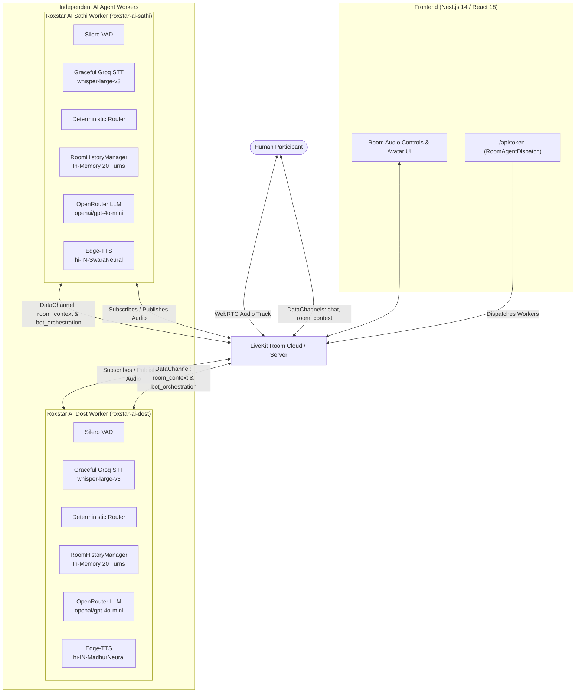
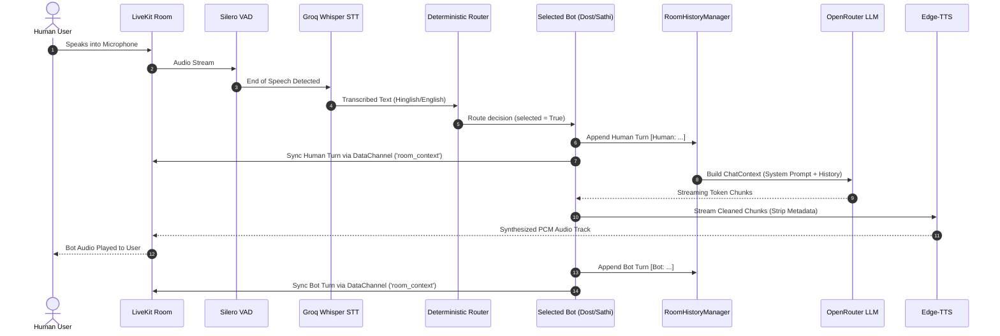
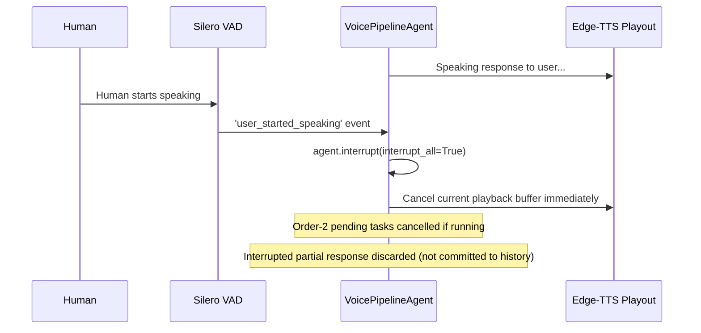

# RoxStar AI Voice Room Assistant

[](https://nextjs.org/)
[](https://reactjs.org/)
[](https://www.python.org/)
[](https://livekit.io/)
[](https://www.typescriptlang.org/)
[](file:///e:/Resumes/RoxStarAI/Assignment/agent/tests)

A real-time, multi-user voice room powered by **LiveKit WebRTC**, featuring two distinct AI conversational participants—**Roxstar AI Dost** and **Roxstar AI Sathi**. Both agents understand Hindi, English, and Roman-script Hinglish, maintain unified room context across human and bot turns, coordinate via deterministic routing and event-driven orchestration, support instant barge-in interruption, and implement multi-layer failure resilience.

---

## Demo

| Resource | Link |
| :--- | :--- |
| **Demo Video** | [Watch Demo Walkthrough (Placeholder)](#) *(5–10 min complete demonstration)* |
| **Live Web App** | [Launch Live Room (Placeholder)](#) |
| **GitHub Repository** | [sameerakmal/Roxstar-AI](https://github.com/sameerakmal/Roxstar-AI) |

### What the Demo Shows

1. **End-to-End Voice Flow**: Live microphone input through WebRTC audio to speech synthesis with sub-second responsiveness.
2. **Natural Hindi/Hinglish**: Everyday conversational Hindi/Hinglish mixing technical terms naturally, avoiding textbook phrasing.
3. **English Understanding**: Full comprehension of spoken English queries with natural Hinglish or English responses.
4. **Multi-Turn Room Memory**: Natural follow-ups (*"Iske baare mein aur batao"*, *"Can you give an example?"*) using conversation history.
5. **Multi-User Room Context**: Human participant turns and bot responses are attributed and synchronized across participants.
6. **Session Memory**: In-memory sliding window preserves conversational context across turns within a room session.
7. **Interruption / Barge-in**: Speaking while a bot speaks immediately halts playback and cancels ongoing speech synthesis.
8. **Deterministic Two-Bot Routing**: Direct addressing (*"Dost, batao"* vs *"Sathi, samjhao"*) and unaddressed queries routed to the default bot.
9. **Ordered Dost → Sathi Orchestration**: Sequential handoffs (*"AI Dost, tum answer karo. AI Sathi, example dena"*) coordinated via WebRTC DataChannel completion events without arbitrary delays.
10. **Provider Resilience & Graceful Fallback**: Graceful error interception and fallback audio playback upon provider failure with seamless recovery on subsequent turns.

---

## Key Features

| Category | Capability | Implementation Detail |
| :--- | :--- | :--- |
| **Real-Time Transport** | WebRTC Audio Room | Ultra-low latency audio publication & subscription via LiveKit Cloud/Server. |
| **Dual AI Personas** | Dost & Sathi | Two independent worker processes with distinct Indian voices, system prompts, and personas. |
| **Multilingual Voice** | Hindi, Hinglish, English | Groq Whisper STT + OpenRouter LLM configured for everyday conversational Indian Hinglish. |
| **Voice Synthesis** | Indian Neural Voices | Microsoft Edge-TTS neural Hindi voices (`hi-IN-MadhurNeural` and `hi-IN-SwaraNeural`). |
| **Deterministic Routing** | Context-Aware Router | Regex and token analysis identifying explicit address, generic nouns, referential mentions, and dual-bot turns. |
| **Ordered Orchestration** | Event-Driven Sequencing | Multi-bot plans announced and completed over LiveKit DataChannel (`bot_orchestration`), eliminating sleep delays. |
| **Shared Room Context** | Cross-Worker State Sync | In-memory canonical turn history (`RoomHistoryManager`) synchronized across workers via DataChannel (`room_context`). |
| **Interruption Handling** | Instant Playout Cancellation | Silero VAD detects user speech; triggers `agent.interrupt(interrupt_all=True)` to halt playback immediately. |
| **Failure Handling** | Graceful Degradation | Catches STT rate limits, LLM 503/401 errors, and TTS drops with persona-tailored fallback audio. |
| **Observability & Security** | Redacted Structured Logs | Turn lifecycle, latency, routing, and DataChannel events logged with regex sanitization of API keys. |
| **Text + Voice Integration** | Dual Interaction Modes | Microphone input stays in voice pipeline; text chat appears in UI; both share unified room memory. |
| **Testing** | 72 Automated Unit Tests | 100% passing test suite covering routing, orchestration, context sync, interruption, and failure recovery. |

---

## Architecture

### System Architecture Overview



### Normal Voice Turn Sequence



### Ordered Multi-Bot Orchestration Sequence

```mermaid
sequenceDiagram
    autonumber
    actor Human as Human User
    participant LK as LiveKit Room
    participant Dost as Dost Worker (Order 1)
    participant Sathi as Sathi Worker (Order 2)
    participant DC as DataChannel ('bot_orchestration')

    Human->>LK: "AI Dost, tum answer karo. AI Sathi, baad mein example dena."
    Note over Dost,Sathi: Both workers parse identical MultiBotPlan (Dost=1, Sathi=2)
    Dost->>Dost: Order 1 proceeds immediately to LLM + TTS
    Sathi->>Sathi: Order 2 registers pending plan, suppresses immediate turn
    Dost-->>LK: Dost speaks answer to user
    Note over Dost: Agent speech committed & completed
    Dost->>DC: Publish 'bot_turn_complete' (order=1, content="...")
    DC->>Sathi: Receive 'bot_turn_complete'
    Note over Sathi: Release Order 2; inject Dost's response into context
    Sathi->>Sathi: Generate targeted follow-up building on Dost's explanation
    Sathi-->>LK: Sathi speaks example to user
```

---

## Technology Stack

| Layer | Technology | Purpose in Project |
| :--- | :--- | :--- |
| **Frontend Framework** | Next.js 14.2 (App Router) | Client application hosting, responsive room UI, avatar visualizers. |
| **UI Library** | React 18.3, TypeScript 5.4 | Component state management, type-safe interfaces. |
| **Styling** | Vanilla CSS (`globals.css`) | Custom dark-mode styling, glassmorphism, responsive sidebar, animations. |
| **Icons** | Lucide React | Clean, modern interface icons for controls, mic, chat, and status. |
| **LiveKit Client SDK** | `@livekit/components-react` (2.6.3), `livekit-client` (2.5.9) | WebRTC room connectivity, participant audio track management, DataChannel I/O. |
| **LiveKit Server SDK** | `livekit-server-sdk` (2.7.2) | Server-side JWT token generation and embedded `RoomAgentDispatch`. |
| **AI Agent Runtime** | Python 3.10+ / 3.12, `livekit-agents` (1.8.0) | Asynchronous agent workers connecting to LiveKit room sessions. |
| **Voice Activity Detection** | Silero VAD (`livekit-plugins-silero` 0.7.6) | High-accuracy local voice detection for speech boundary & barge-in. |
| **Speech-to-Text (STT)** | Groq Whisper Large v3 (`livekit-plugins-groq` 1.8.0) | High-speed cloud Whisper transcription with custom prompt conditioning for Hinglish. |
| **LLM Provider** | OpenRouter (`AsyncOpenAI` client) | Hosted inference running `openai/gpt-4o-mini` with streaming responses. |
| **Text-to-Speech (TTS)** | Microsoft Edge-TTS (`edge-tts` 7.0.0, custom wrapper) | Natural Indian English/Hindi neural voices without paid per-character API costs. |
| **Audio Processing** | PyAV (`av` 10.0.0) | Low-level audio frame manipulation and decoding for Edge-TTS PCM pipeline. |
| **Testing** | `pytest` 8.0+, `pytest-anyio` | Unit and integration test suite (72 tests passing). |

---

## End-to-End Voice Pipeline

The audio pipeline executes as a continuous, asynchronous streaming loop:

```text
[Microphone] ──> [LiveKit WebRTC Track] ──> [Silero VAD] ──> [GracefulGroqSTT]
                                                                    │
[Edge-TTS Audio] <── [OpenRouter LLM] <── [RoomContext] <── [Deterministic Router]
```

1. **Audio Capture & VAD**: The user speaks into the browser microphone. Audio frames stream over WebRTC to the agent. `silero.VAD` monitors speech frames. When speech ends, it signals the speech boundary.
2. **Transcription (`whisper-large-v3`)**: `GracefulGroqSTT` transcribes speech. An internal conditioning prompt (`STT_PROMPT`) biases Whisper towards Indian names (*Dost*, *Sathi*) and Hindi/Hinglish vocabulary.
3. **Turn Routing & Filtering**:
   - Empty or `<continue>` transcripts are suppressed before reaching the LLM.
   - `route_turn()` inspects the transcript for explicit mentions, generic words, or both-bot requests.
   - If the bot is not selected, `agent.interrupt()` silences any background synthesis and returns `False`.
4. **Context Injection (`RoomHistoryManager`)**: The selected bot retrieves the in-memory shared room context, formats up to 20 previous canonical turns with `[Human]`, `[Roxstar AI Dost]`, and `[Roxstar AI Sathi]` prefixes, and constructs the LLM `ChatContext`.
5. **Streaming Generation**: OpenRouter streams tokens from `openai/gpt-4o-mini`.
6. **TTS Streaming (`_resilient_tts_stream`)**: Text chunks are sanitized to strip internal metadata labels. Clean text chunks stream directly into `EdgeTTS`, producing 24kHz PCM audio frames published back into the LiveKit room.
7. **Interruption & Stale Turn Guard**: If the user starts speaking while TTS is streaming, Silero VAD raises `user_started_speaking`, which immediately interrupts playout and discards remaining audio chunks.

---

## Two AI Personas

Both personas operate as independent, concurrent LiveKit participants with dedicated identities, prompts, and voices:

### 1. Roxstar AI Dost (`roxstar-ai-dost`)
- **Role**: Primary assistant, knowledgeable companion, default respondent.
- **Voice**: `hi-IN-MadhurNeural` (Indian male, warm, friendly tone).
- **Language Style**: Everyday Indian Hinglish. Blends modern Hindi with English terms (*smart*, *decision*, *technology*, *room*, *example*). Avoids bookish/overly formal Sanskritized Hindi.
- **Greeting**: Announces presence on connection: *"Namaste! Main hoon Roxstar AI Dost. Aapka swagat hai room mein! Main aapki kya help kar sakta hoon?"*

### 2. Roxstar AI Sathi (`roxstar-ai-sathi`)
- **Role**: Supportive co-assistant, specialist for intuitive examples, secondary perspective.
- **Voice**: `hi-IN-SwaraNeural` (Indian female, empathetic, clear tone).
- **Language Style**: Warm, conversational Hinglish. Specializes in relatable real-world analogies (*"Aapko main ek easy example se samjhati hoon..."*).
- **Greeting**: Silent on room entry to prevent overlapping greetings; stands by for explicit turns or multi-bot handoffs.

---

## Routing Strategy

The router (`agent/router.py`) deterministically resolves which worker should speak using a hierarchical evaluation engine:

```text
User Utterance
  ├─ Has Both-Bot Trigger ("dono", "both", "dost aur sathi")? ─────────> BOTH (Sequential Plan)
  ├─ Both Bots Explicitly Addressed ("Dost answer karo, Sathi...")? ───> BOTH (Sequential Plan)
  ├─ Sathi Addressed Exclusively ("Sathi, example do")? ────────────────> SATHI
  ├─ Dost Addressed Exclusively ("Dost, batao")? ───────────────────────> DOST
  └─ Unaddressed / Generic ("AI kya hota hai?", "Mera ek dost hai") ───> DOST (Default)
```

### Key Routing Principles
- **Generic Noun Exclusion**: Phrases like *"mera dost"* or *"apne sathi"* use regex lookbehinds to prevent false-positive addressing.
- **Referential Mentions**: In *"Sathi, Dost ne jo bola uska example do"*, *Dost* is detected as a referential object (`REFERENTIAL_DOST_PATTERN`), so only *Sathi* is addressed.
- **Ordered Multi-Bot Orchestration**:
  - When routed to `both`, `parse_ordered_plan()` determines order using explicit keywords (`pehle` / `first` vs `baad mein` / `then`) or positional order.
  - Generates a deterministic `turn_id` synced across workers via an MD5 hash of the prompt.
  - **No Arbitrary Delays**: Order 1 speaks immediately. When Order 1 finishes, it fires a `bot_turn_complete` event on the `bot_orchestration` DataChannel with its exact response. Order 2 unlocks, incorporates Order 1's response into its prompt, and speaks.

---

## Shared Room Context / Memory

Conversation history is managed by `RoomHistoryManager` in [`agent/room_context.py`](file:///e:/Resumes/RoxStarAI/Assignment/agent/room_context.py):

- **In-Memory Architecture**: Lightweight, session-scoped memory held in worker memory for the duration of the room. No external Redis/DB dependency required.
- **Sliding Window**: Retains a strict bound of the last **20 canonical turns**, evicting the oldest entries to prevent LLM context overflow.
- **Cross-Worker Synchronization**: When a human or bot turn completes, the worker serializes the `RoomTurn` into JSON and broadcasts it over the `room_context` DataChannel. The other worker receives and adds it to its local history.
- **Idempotency**: Every turn has a unique `turn_id`. Duplicate arrivals over DataChannels are ignored via `seen_turn_ids`.
- **Speaker Attribution**: Turns are internally recorded as `[Human]`, `[Roxstar AI Dost]`, or `[Roxstar AI Sathi]`. Metadata labels are stripped before TTS synthesis to prevent bots from reading aloud their own tags.

---

## Interruption / Barge-in



1. **VAD Event**: As soon as human speech is detected while an agent is speaking, `agent.on("user_started_speaking")` triggers.
2. **Instant Cancellation**: The agent calls `agent.interrupt(interrupt_all=True)`, canceling active audio streaming and playout.
3. **Orchestration Cancellation**: If an Order 2 task is running or pending, it is immediately canceled.
4. **History Cleanliness**: Interrupted bot responses are discarded and not committed to `RoomHistoryManager`, preventing cut-off speech from polluting context.

---

## Reliability & Failure Handling

The agent includes production-grade resilience patterns validated by automated tests:

| Failure Scenario | Mitigation Mechanism | User-Visible Experience |
| :--- | :--- | :--- |
| **STT Rate Limit (Groq 429)** | `GracefulGroqSTT` catches `RateLimitError`, parses `retry-after`, and returns an empty transcript safely. | Agent remains silent instead of throwing an unhandled exception or crashing. |
| **Empty / Whitespace Transcript** | Gate 1 check in `before_llm_cb` returns `False` for empty or `<continue>` transcripts. | Prevents empty hallucinations; agent waits for genuine speech. |
| **LLM Provider Error (503 / 401 / Timeout)** | `_resilient_tts_stream` catches LLM stream exceptions and yields persona fallback audio. | Dost speaks *"Thoda technical issue aa gaya..."*; Sathi speaks *"Kuch technical problem aa gayi hai..."*. |
| **TTS Network Drop / Timeout** | `EdgeTTS` synthesis loop handles stream drops without propagating crashes. | Playback ends gracefully without taking down the worker. |
| **DataChannel Sync Drop** | DataChannel publish calls are wrapped in non-blocking async tasks with try-except guards. | Room context sync failure logs a warning; core voice conversation continues uninterrupted. |
| **Malformed Context Events** | `deserialize_turn_event()` validates JSON structure, keys, and types before processing. | Corrupt or unexpected DataChannel messages are safely ignored. |
| **Secret Exposure in Logs** | `sanitize_log_message()` uses regex to mask OpenRouter keys, Groq keys, and bearer tokens. | Logs display `[REDACTED_API_KEY]` instead of raw credentials. |

---

## Observability

The application uses structured, prefixed logging across all stages of turn processing:

```text
[CONNECTION]   Participant join/leave events and identity validation
[RoutingDebug] Transcript text, addressing cues, and agent selection outcome
[TurnDebug]    Task ID, routing gate evaluation, and allow/suppress decisions
[TranscriptState] Pre-LLM and pre-TTS transcript state verification
[BotLifecycle] Turn received, LLM started/finished, and speech started/finished events
[Latency]      Turn start to completion duration tracking (e.g. total_ms=1420)
[Orchestration] Plan announcement, order-1 completion, and order-2 release events
[ROOM]         Room context DataChannel sync and serialization events
[LLM]          Provider exceptions and fallback yield events with status codes
```

All log messages pass through `sanitize_log_message` before console output, guaranteeing that sensitive bearer tokens or API keys (`sk-...`, `gsk_...`) never appear in terminal output or log aggregators.

---

## Text + Voice Interaction

The room supports seamless coexistence of voice and text communication:

- **Voice Pipeline**: User speaks via microphone $\rightarrow$ processed through VAD, STT, LLM, and TTS $\rightarrow$ audio is played back. Neither human spoken input nor AI voice responses pollute the UI text chat.
- **Text Chat Pipeline**: User types in the UI chat sidebar $\rightarrow$ sent over DataChannel `topic="chat"` $\rightarrow$ answered by the addressed bot $\rightarrow$ response is published back to `topic="chat"` and rendered as a chat bubble.
- **Unified Room Context**: Regardless of whether a message originated via voice or text, both update `RoomHistoryManager`. An answer given via voice is immediately part of context for a follow-up asked in text chat (and vice versa).

---

## Getting Started

### Prerequisites
- **Node.js**: `v18.17.0+` or `v20.x`
- **Python**: `3.10`, `3.11`, or `3.12`
- **LiveKit Cloud Account**: Free project at [cloud.livekit.io](https://cloud.livekit.io/)
- **Groq Cloud API Key**: For Whisper STT at [console.groq.com](https://console.groq.com/)
- **OpenRouter API Key**: For LLM at [openrouter.ai](https://openrouter.ai/)

---

### 1. Environment Configuration

Create a `.env` file in the root directory (and copy to `frontend/.env`):

```bash
# LiveKit Credentials
LIVEKIT_URL=wss://your-project.livekit.cloud
LIVEKIT_API_KEY=your_livekit_api_key
LIVEKIT_API_SECRET=your_livekit_api_secret

# Frontend Public URL
NEXT_PUBLIC_LIVEKIT_URL=wss://your-project.livekit.cloud

# AI Provider Keys
OPENROUTER_API_KEY=sk-or-v1-your_openrouter_key
GROQ_API_KEY=gsk_your_groq_key
```

---

### 2. Frontend Setup

In a new terminal:

```bash
cd frontend
npm install
npm run dev
```

The web interface will start at `http://localhost:3000`.

---

### 3. Agent Worker Setup

In a separate terminal, set up the Python virtual environment:

```bash
cd agent
python -m venv venv

# Windows:
.\venv\Scripts\activate

# macOS / Linux:
source venv/bin/activate

pip install -r requirements.txt
```

#### Terminal A: Start Roxstar AI Dost (Primary Worker)
```bash
# Windows PowerShell:
$env:AGENT_NAME="roxstar-ai-dost"; python agent.py dev

# macOS / Linux:
AGENT_NAME="roxstar-ai-dost" python agent.py dev
```

#### Terminal B: Start Roxstar AI Sathi (Co-Assistant Worker)
```bash
# Windows PowerShell:
$env:AGENT_NAME="roxstar-ai-sathi"; python agent.py dev

# macOS / Linux:
AGENT_NAME="roxstar-ai-sathi" python agent.py dev
```

---

### 4. Running the Tests

The test suite runs with `pytest` and verifies all components without needing external live API credentials:

```bash
cd agent
.\venv\Scripts\pytest.exe -v
```

**Test Suite Coverage (72 passing tests)**:
- `test_router.py`: Explicit routing, generic noun filtering, referential mention handling, multi-bot ordering.
- `test_orchestration.py`: Multi-bot plan execution, completion signaling, interruption suppression, context enrichment.
- `test_shared_room_context.py`: Turn serialization, deduplication, sliding window eviction, speaker prefixing.
- `test_reliability_failure_handling.py`: STT 429 backoff, LLM exception fallback, TTS drop handling, credential sanitization.
- `test_lifecycle_routing.py`: Empty transcript suppression, turn ownership locking, stale speech prevention.
- `test_dost_agent.py`: System prompt formatting, participant identification, Groq STT instantiation.

---

### 5. Joining the Room

1. Navigate to `http://localhost:3000` in Google Chrome or Microsoft Edge.
2. Enter your name and click **Join Room**.
3. Allow microphone permissions.
4. **Roxstar AI Dost** will greet you automatically in natural Hinglish.
5. Start speaking or typing in the chat!
